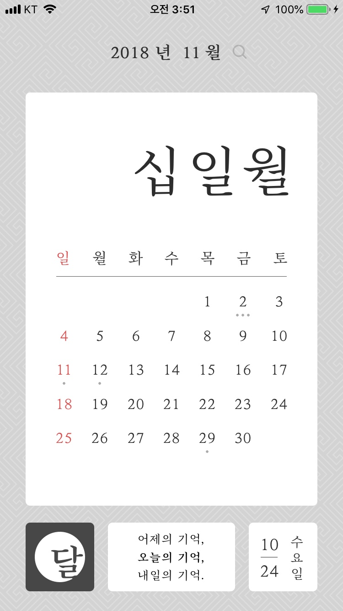
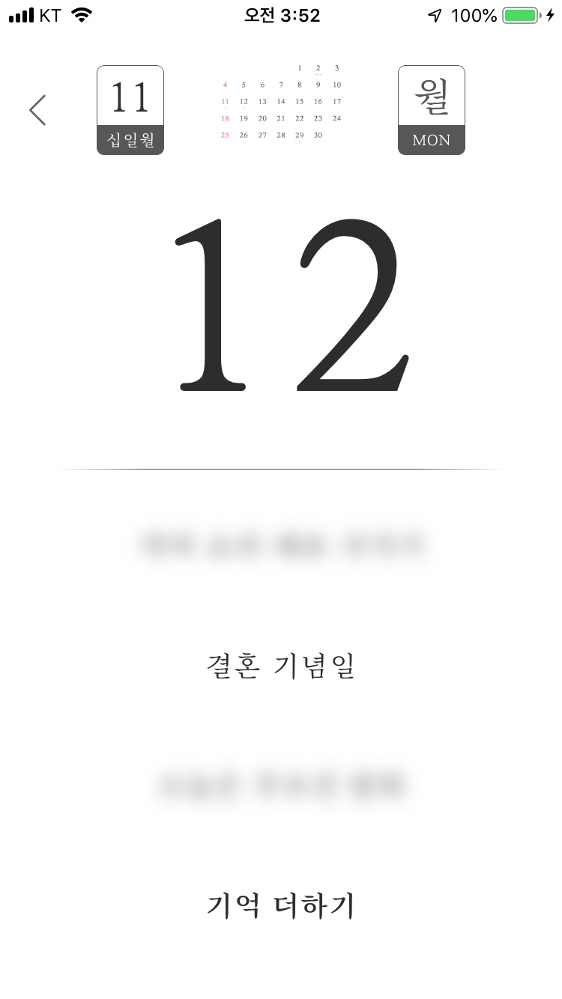
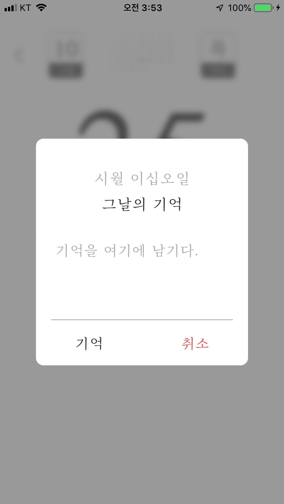

# 어디주유 Where Gas Stations

 

## Content

- [About Applications](#about-applications)
- [Preview](#preview)
- [Version History](#version-history)
- [Download](#download)
- [What we learned on this project](#what-we-learned-on-this-project)

 

## About Applications

- 프로젝트 기간: 18.08 ~ 18.10
- 정보 제공 단계에 스와이프 단계를 추가하여, 한번더 생각해볼 수 있는 시간을 주는 달력
- 어플의 기능
>- 달력 기능
>- 메모 기능
>- 날짜 검색 기능
>- 메모 리스트 기능

 

## Preview

<a href="https://vimeo.com/297006585"> '그날' 실행 영상 </a>   

## Version History

- ver 1.0.00 : App Store release(18.10.25)
- ver 1.0.01 : Bug fix(18.10.25)

 

## Download

 

## What we learned on this project

- RealmSwift
- App Delegate Life Cycle & When use App Delegate Function
- Passing data between ViewControllers using segue
- Reuse TableviewCell
- Autolayout by device

 
